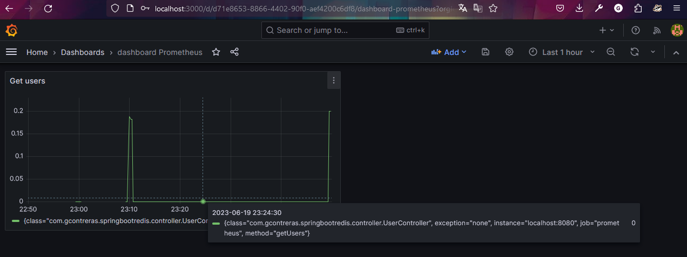

# spring-boot-redis

Se adjunta collection en la raíz del proyecto **Proyecto JPA.postman_collection**

# Prometheus
Se encarga de recopilar, almacenar y analizar métricas mediante la exposición de endpoints HTTP por parte de las aplicaciones y servicios que se desean monitorizar.
## Pasos para su configuración
* Puedes descargar prometheus del siguiente enlace: https://prometheus.io/download/
* Una vez descargado, lo debes descomprimir entrar a la carpeta y ejecutar: **prometheus.exe**
* Una vez iniciado puedes acceder a la siguiente URL: http://localhost:9090/graph
* Modificaremos el archivo **prometheus.yml** para que utilice las métricas que estamos generando en nuestra aplicación como se muestra a continuación:
    * 
* Una vez hecho lo anterior entrar de nuevo a la Url y verás las métricas de tu aplicación


# Grafana
Proporciona una interfaz de usuario intuitiva y potente para visualizar y analizar esos datos de manera flexible y personalizada. Integra de manera nativa con Prometheus y otras fuentes de datos. 

## Pasos para su configuración
* Link para descargar https://grafana.com/grafana/download?platform=windows
* Una vez descargado, ir al ejecutable: C:\Program Files\GrafanaLabs\grafana\bin\grafana-server.exe
* Abre la URL http://localhost:3000/ iniciar sesión con usuario admin 
* Para configurar enlace entre prometheus y grafana. Selecciona en el side bar :
    * Configuración,
    * Datasources,
    * Add datasource,
    * Selecciona Prometheus: 
        * Name = Prometheus,
        * Prometheus server URL = http: / /localhost:9090
    * Como la siguiente imagen: 

### Creación de un dashboard
Para crear un dashboard de grafana, selecciona el símbolo + de la barra de la izquierda y sigue los siguientes pasos:
* Crea un panel
    * En la sección de Metrics, selecciona Prometheus y coloca el query que deseas
utilizar, en el ejemplo utilizaremos :
```Metrics
rate(get_user_seconds_count[$__rate_interval])
```
* Ejemplo:
    * 
    * 
    * 

